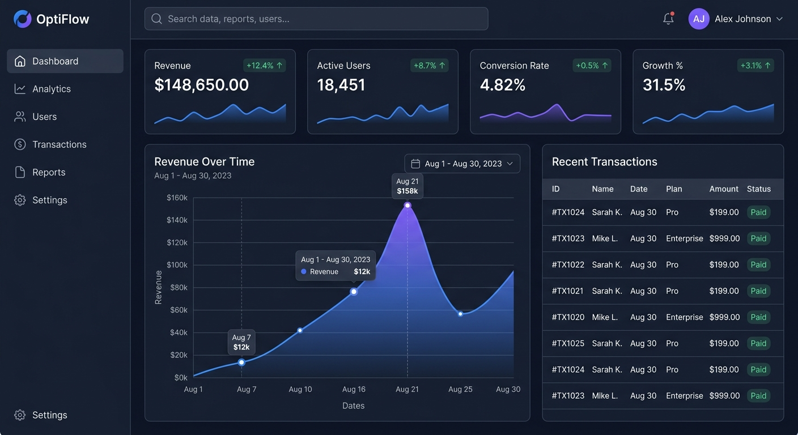
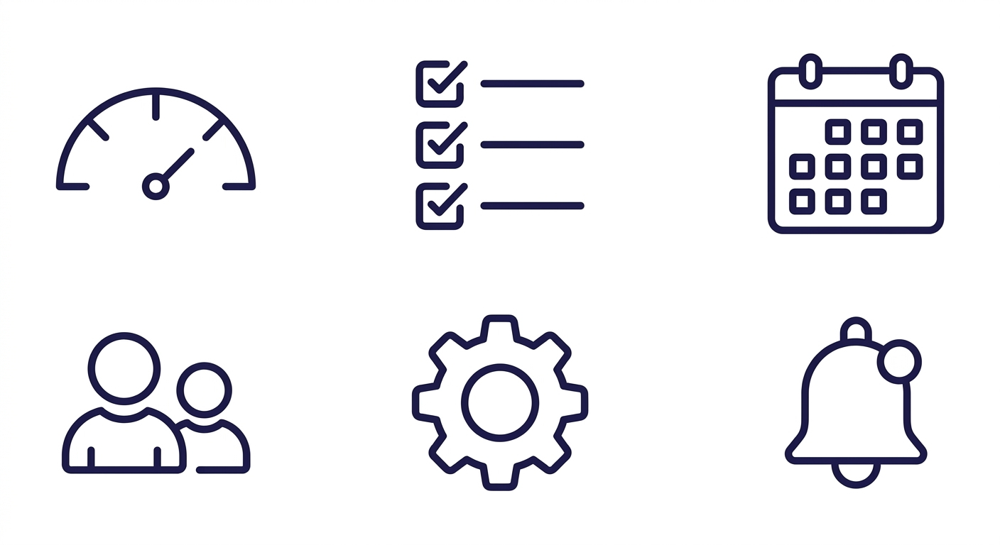
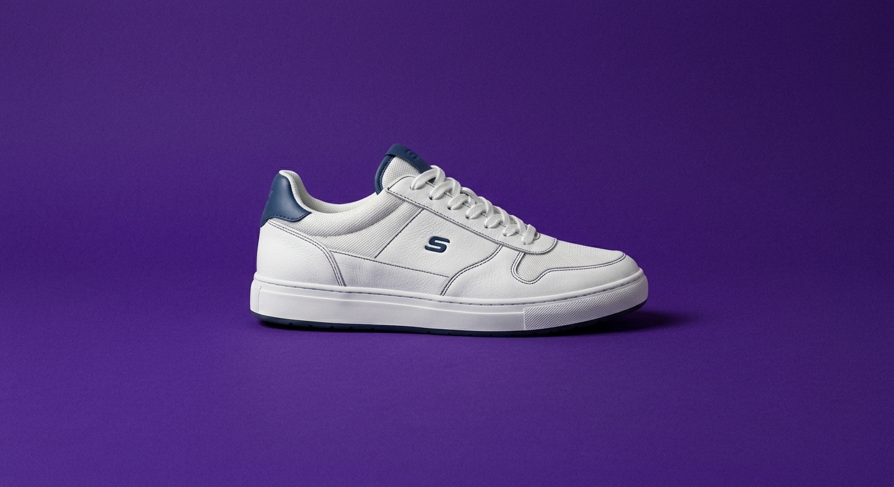

# Gemini Visual Design

> Generate, edit, analyze, and animate visual designs with Google Gemini — directly inside Claude Code.

[](LICENSE)
[](https://www.python.org/downloads/)
[](pyproject.toml)
[](https://github.com/BeckhamLabsLLC/gemini-visual-design/actions/workflows/ci.yml)
[](https://docs.claude.com/en/docs/claude-code/plugins)



> *Generated in one command:* `/design-mockup A dark analytics dashboard with sidebar nav, KPI cards, an area chart, and a transactions table`
>
> Every screenshot in this README is a real, unretouched output from the plugin's own MCP tools — no Photoshop, no mockup tool. The exact prompt used for each one is shown in its caption.

## Why this plugin

Calling Gemini directly is easy. Calling it *well* — without burning quota on bad prompts, generic outputs, or one-off images that don't match your project — is the hard part.

This plugin wraps the Google GenAI SDK in a **prompt enhancement pipeline** (validation → templates → style-profile injection → API), a **draft-first workflow** (fast Gemini Flash for iteration, Imagen 4 for finals, Veo for video), an **edit-over-regenerate** philosophy via multi-turn image editing, and **project-aware style profiles** that auto-detect your Tailwind/CSS config so every generation inherits your colors, typography, and aesthetic. Plus the `visual-enhancer` agent that proactively suggests visual upgrades after Claude writes UI code.

## Quick start (5 minutes)

```bash
# 1. Get a free API key at https://aistudio.google.com/apikey
export GEMINI_API_KEY="your-key-here"

# 2. Install
cd gemini-visual-design
pip install -e .

# 3. Restart Claude Code so it picks up the .mcp.json
```

Then, in any project, ask Claude:

```
/design-mockup A dark-themed analytics dashboard with sidebar navigation and KPI cards
```

You'll get a generated image at `~/.cache/gemini-visual-design/preview/` plus a tip on how to refine it with `edit_image` or save it into your project with `save_asset`.

## Gallery

<details>
<summary><strong>Icon set generation</strong></summary>



```
/create-asset A clean grid of 6 minimal line icons in a 3x2 layout for a
project management app: dashboard (gauge), tasks (checklist), calendar
(calendar grid), team (people group), settings (gear), notifications (bell).
Consistent 2px stroke, rounded line caps, monochrome dark indigo.
```
</details>

<details>
<summary><strong>Edit, don't regenerate</strong></summary>

| Before | After |
|---|---|
|  |  |

```
edit_image
  image_path: docs/screenshots/edit-before.jpg
  instruction: Replace the beige background with a deep rich purple (#4c1d95),
               keep the sneaker exactly the same, add subtle film grain noise
               on the background only, preserve all lighting and shadows.
```

Multi-turn editing keeps the original intact and preserves the subject — every pixel of the sneaker above is unchanged. Each refinement is one API call instead of a full regeneration.
</details>

<details>
<summary><strong>Design analysis with scored categories</strong></summary>

```
/review-visuals docs/screenshots/hero-dashboard.jpg
```

Returns a structured JSON critique with scored categories and concrete edit instructions that can be piped straight into `edit_image`. Here's the actual output for the hero image above:

```json
{
  "overall_score": 9.0,
  "categories": {
    "color":      { "score": 9.5, "summary": "Excellent dark theme palette..." },
    "layout":     { "score": 9.0, "summary": "Clean, grid-based layout..." },
    "typography": { "score": 9.5, "summary": "Clear, modern sans-serif..." },
    "usability":  { "score": 8.5, "summary": "Intuitive navigation..." }
  },
  "top_issues": [
    {
      "issue": "Missing 'Settings' menu item in main sidebar.",
      "severity": "medium",
      "edit_instruction": "Add a 'Settings' item with a gear icon to the main navigation menu, just below 'Reports'."
    },
    {
      "issue": "Search bar lacks explicit 'Search' button or visual action affordance.",
      "severity": "medium",
      "edit_instruction": "Add a search button with a magnifying glass icon to the right side of the search bar..."
    }
  ]
}
```

Each `edit_instruction` is shaped to feed directly into `edit_image`, closing the loop: analyze → fix → re-analyze. Full output: [`docs/screenshots/hero-dashboard.analysis.json`](docs/screenshots/hero-dashboard.analysis.json).
</details>

<details>
<summary><strong>Text-to-video with Veo</strong></summary>

```
/create-video Slow camera dolly forward through a futuristic data center, blue ambient lighting
```

Polls asynchronously, returns an `.mp4` in the preview directory. Supports image-to-video too — pass a reference frame and Veo will animate it according to your prompt.
</details>

## Commands

| Command | Description |
|---------|-------------|
| `/design-mockup` | Interactive mockup generation — draft, iterate, finalize |
| `/create-asset` | Generate visual assets (icons, textures, illustrations) |
| `/create-video` | Generate short video clips from text or reference images |
| `/review-visuals` | Analyze design screenshots with actionable suggestions |
| `/design-system` | Generate design tokens and style profiles |

## MCP tools

| Tool | Description |
|------|-------------|
| `generate_image` | Generate images with Gemini (drafts) or Imagen 4 (finals) |
| `edit_image` | Edit existing images with natural language instructions |
| `analyze_design` | Visual design critique with scored categories |
| `generate_video` | Generate video clips with Veo models |
| `save_asset` | Save generated assets from preview to project |
| `list_generated` | List all generated assets with metadata |
| `generate_design_tokens` | Generate CSS/Tailwind/JSON design tokens |
| `init_style_profile` | Create or update project style profile |
| `get_prompt_templates` | Browse available prompt templates |

## How it compares

| | This plugin | `google-genai` SDK | Official Gemini CLI |
|---|---|---|---|
| Project-aware style profiles | ✅ | ❌ | ❌ |
| Prompt enhancement pipeline | ✅ | ❌ | ❌ |
| Template library (UI, icons, game, landing pages) | ✅ | ❌ | partial |
| Multi-turn image editing | ✅ | manual | manual |
| Design analysis with scored critique | ✅ | manual | ❌ |
| Native Claude Code integration (commands, agent, hook) | ✅ | n/a | ❌ |
| Asset history with metadata sidecars | ✅ | ❌ | ❌ |
| Auto-cleanup of preview cache | ✅ | n/a | ❌ |

The differentiation is the workflow scaffolding around the API, not the API itself. If you're calling Gemini once, use the SDK. If you're using it as part of an iterative design loop in Claude Code, use this.

## Style profiles

Create a `.gemini-design-profile.json` in your project root to maintain visual consistency across every generation:

```json
{
  "project_type": "web-app",
  "framework": "React + Tailwind CSS",
  "design_system": "custom",
  "colors": {
    "primary": "#3b82f6",
    "secondary": "#8b5cf6",
    "background": "#0f172a",
    "surface": "#1e293b",
    "text": "#f8fafc"
  },
  "typography": {
    "style": "modern sans-serif",
    "heading_font": "Inter",
    "body_font": "Inter"
  },
  "visual_style": "clean, minimal, dark mode",
  "default_aspect_ratio": "16:9",
  "default_resolution": "1K"
}
```

Or skip the manual setup — run `init_style_profile` with `auto_detect: true` and the plugin will scan your existing Tailwind config and CSS files to populate this for you.

## Installation (detailed)

### 1. Get a Gemini API Key

Get your API key at [Google AI Studio](https://aistudio.google.com/apikey). The free tier covers basic text and the Gemini Flash family; Imagen 4 and Veo require billing enabled on your Google Cloud project.

### 2. Set the environment variable

```bash
export GEMINI_API_KEY="your-api-key-here"
```

Add it to `~/.bashrc` or `~/.zshrc` so it persists.

### 3. Install dependencies

```bash
cd gemini-visual-design
pip install -e .
```

### 4. Use as a Claude Code plugin

The plugin is auto-detected when placed in your Claude Code plugins directory. The `.mcp.json` and `.claude-plugin/plugin.json` manifests configure the MCP server, slash commands, the `visual-enhancer` agent, the `visual-design-system` skill, and the API-key validation hook. After installing, restart Claude Code so the MCP server starts.

## File locations

- **Preview directory**: `~/.cache/gemini-visual-design/preview/`
- **Style profile**: `.gemini-design-profile.json` (project root)
- **Metadata sidecars**: `{filename}.meta.json` alongside each generated file
- **Auto-cleanup**: Preview files older than 7 days are removed automatically

## Examples

### Generate a UI mockup
```
/design-mockup A dark-themed analytics dashboard with sidebar navigation and KPI cards
```

### Create game assets
```
/create-asset A pixel art treasure chest icon for inventory UI, 32x32 style
```

### Generate a video clip
```
/create-video Slow dolly forward through a misty forest at dawn, soft volumetric lighting
```

### Review an existing design
```
/review-visuals path/to/screenshot.png
```

### Set up a design system
```
/design-system Modern SaaS design tokens with blue primary and dark mode
```

## Troubleshooting

**Missing API key**: Set `GEMINI_API_KEY` and restart Claude Code. The session-start hook will warn you if it's not set.

**Quota errors**: You've exceeded the Gemini API rate limit. The client has built-in exponential backoff for transient errors — wait a moment and retry. For sustained workloads, enable billing on your Google Cloud project.

**`limit: 0` in the quota error**: Your account doesn't have free-tier access to that specific model. Either enable billing or switch the model in `src/gemini_visual_mcp/config.py` to one your account has access to (then restart Claude Code).

**Content policy blocks**: Gemini refused to generate the image. Rephrase your prompt to avoid content that violates Google's safety policies.

**Slow video generation**: Video generation with Veo takes 1–3 minutes. This is normal. The polling has a 5-minute timeout.

**Style mismatch**: Generated assets don't match your project's look. Run `init_style_profile` with `auto_detect: true` to scan your existing CSS/Tailwind config and create a matching style profile.

**Plugin doesn't load**: Make sure the plugin is in your Claude Code plugins directory and that you restarted Claude Code. Check `~/.claude/logs/` for the MCP server's startup line — it logs the version, API key status, and the list of registered tools.

## Contributing

See [CONTRIBUTING.md](CONTRIBUTING.md) for development setup and guidelines. Bug reports and PRs welcome. Changelog at [CHANGELOG.md](CHANGELOG.md).
