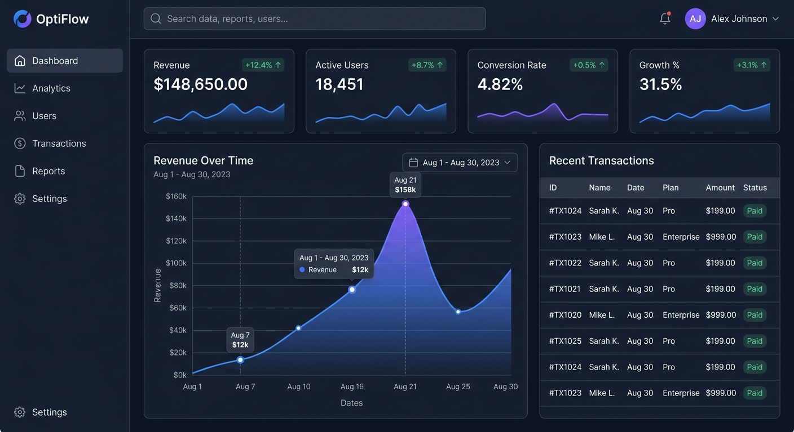
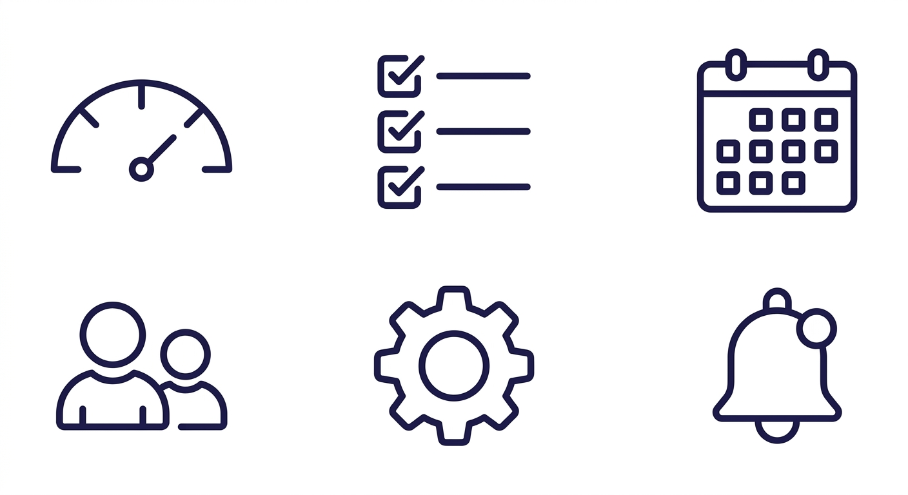

# Gemini Visual Design

> Generate, edit, analyze, and animate visual designs with Google Gemini — directly inside Claude Code.

[](LICENSE)
[](https://github.com/BeckhamLabsLLC/gemini-visual-design/actions/workflows/ci.yml)
[](https://docs.claude.com/en/docs/claude-code/plugins)



> *Generated in one command:* `/design-mockup A dark analytics dashboard with sidebar nav, KPI cards, an area chart, and a transactions table`
>
> Every screenshot in this README is real, unretouched output from the plugin's own MCP tools — no Photoshop, no mockup tool. The exact prompt used for each one is shown in its caption. (Image models are non-deterministic, so the same prompt will give you something similar, not identical.)

## Why this plugin

Calling Gemini directly is easy. Calling it *well* — without burning quota on bad prompts, generic outputs, or one-off images that don't match your project — is the hard part.

Most Gemini MCP servers stop at "here's an image." This one reads your Tailwind/CSS config, generates in *your* palette and typography, critiques the result, and hands you the edit command to fix it — without leaving Claude Code.

Concretely, it wraps the Google GenAI SDK in a **prompt enhancement pipeline** (validation → templates → style-profile injection → API), a **draft-first workflow** across three cost tiers, an **edit-over-regenerate** philosophy via multi-turn image editing, and **project-aware style profiles** so every generation inherits your design language. Plus the `visual-enhancer` agent that proactively suggests visual upgrades after Claude writes UI code.

## Install

**1. Get a Gemini API key** at [aistudio.google.com/apikey](https://aistudio.google.com/apikey) and export it (add it to `~/.bashrc` or `~/.zshrc` so it persists):

```bash
export GEMINI_API_KEY="your-key-here"
```

> **Billing is required.** No Gemini image or video model has a free tier. See [What it costs](#what-it-costs).

**2. Install the plugin** — from inside Claude Code:

```
/plugin install gemini-visual-design --marketplace BeckhamLabsLLC/gemini-visual-design
```

<details>
<summary>On Claude Code older than v2.1.275</summary>

```
/plugin marketplace add BeckhamLabsLLC/gemini-visual-design
/plugin install gemini-visual-design@gemini-visual-design
```
</details>

**3. Restart Claude Code**, then in any project:

```
/design-mockup A dark-themed analytics dashboard with sidebar navigation and KPI cards
```

You'll get a generated image in `~/.cache/gemini-visual-design/preview/` plus a tip on how to refine it with `edit_image` or save it into your project with `save_asset`.

<details>
<summary>Run from a clone instead (contributors)</summary>

```bash
git clone https://github.com/BeckhamLabsLLC/gemini-visual-design.git
cd gemini-visual-design
claude --plugin-dir .
```

See [CONTRIBUTING.md](CONTRIBUTING.md) for the dev setup.
</details>

## Requirements

| | Requirement | Notes |
|---|---|---|
| Claude Code | v2.1.275+ | Older versions: use the two-step install above |
| [`uv`](https://docs.astral.sh/uv/) | required | The MCP server runs under `uv run`, so Python dependencies install themselves |
| Python | 3.10–3.12 | Tested in CI |
| Gemini API key | required | [aistudio.google.com/apikey](https://aistudio.google.com/apikey) |
| Billing enabled | **required** | No image or video model has a free tier |

## What it costs

You pay Google directly; this plugin takes nothing. Prices as of September 2026:

| `model=` | Used for | Price |
|---|---|---|
| `draft` | Cheapest iteration | $0.034 / image (1K) |
| `fast` *(default)* | Drafts and most generation | $0.067 / image (1K) |
| `pro` | Finals — legible text, best fidelity | $0.134 (1K–2K) · $0.24 (4K) |
| `veo-3.1-lite` | Cheapest video | $0.05/sec — a 4s clip ≈ **$0.20** |
| `veo-3.1-fast` *(default)* | Balanced video | $0.12/sec at 1080p — an 8s clip ≈ **$0.96** |
| `veo-3.1` | Best video | $0.40/sec |

**There is no free tier for image or video generation.** A typical mockup session — one draft, three edits, one critique — runs about **$0.30**. `analyze_design` runs on a text model and costs fractions of a cent.

## Privacy

Every prompt you send, and every image passed to `edit_image` or `analyze_design`, is uploaded to Google's Gemini API. Your `.gemini-design-profile.json` contents (colors, fonts, framework) are injected into prompts and therefore sent too. Nothing goes anywhere else — no telemetry, no analytics, one outbound host. Generated assets and their metadata sidecars stay local in `~/.cache/gemini-visual-design/preview/`.

## Gallery

<details>
<summary><strong>Icon set generation</strong></summary>



```
/create-asset A clean grid of 6 minimal line icons in a 3x2 layout for a
project management app: dashboard (gauge), tasks (checklist), calendar
(calendar grid), team (people group), settings (gear), notifications (bell).
Consistent 2px stroke, rounded line caps, monochrome dark indigo.
```
</details>

<details>
<summary><strong>Edit, don't regenerate</strong></summary>


<sub>Looping between the original and the edited result. Both are real outputs; only the background changed.</sub>

```
edit_image
  image_path: docs/screenshots/edit-before.jpg
  instruction: Replace the beige background with a deep rich purple (#4c1d95),
               keep the sneaker exactly the same, add subtle film grain noise
               on the background only, preserve all lighting and shadows.
```

Multi-turn editing keeps the original intact and preserves the subject — every pixel of the sneaker above is unchanged. Each refinement is one API call instead of a full regeneration.
</details>

<details>
<summary><strong>Design analysis with scored categories</strong></summary>

```
/review-visuals docs/screenshots/hero-dashboard.jpg
```

Returns a structured JSON critique with scored categories and concrete edit instructions that can be piped straight into `edit_image`. Here's the actual output for the hero image above:

```json
{
  "overall_score": 9.0,
  "categories": {
    "color":      { "score": 9.5, "summary": "Excellent dark theme palette..." },
    "layout":     { "score": 9.0, "summary": "Clean, grid-based layout..." },
    "typography": { "score": 9.5, "summary": "Clear, modern sans-serif..." },
    "usability":  { "score": 8.5, "summary": "Intuitive navigation..." }
  },
  "top_issues": [
    {
      "issue": "Missing 'Settings' menu item in main sidebar.",
      "severity": "medium",
      "edit_instruction": "Add a 'Settings' item with a gear icon to the main navigation menu, just below 'Reports'."
    },
    {
      "issue": "Search bar lacks explicit 'Search' button or visual action affordance.",
      "severity": "medium",
      "edit_instruction": "Add a search button with a magnifying glass icon to the right side of the search bar..."
    }
  ]
}
```

Each `edit_instruction` is shaped to feed directly into `edit_image`, closing the loop: analyze → fix → re-analyze. Full output: [`docs/screenshots/hero-dashboard.analysis.json`](docs/screenshots/hero-dashboard.analysis.json).
</details>

<details>
<summary><strong>Text-to-video with Veo</strong></summary>

```
/create-video Slow camera dolly forward through a futuristic data center, blue ambient lighting
```

Polls asynchronously, returns an `.mp4` in the preview directory. Supports image-to-video too — pass a reference frame and Veo will animate it according to your prompt.
</details>

## Commands

| Command | Description |
|---------|-------------|
| `/design-mockup` | Interactive mockup generation — draft, iterate, finalize |
| `/create-asset` | Generate visual assets (icons, textures, illustrations) |
| `/create-video` | Generate short video clips from text or reference images |
| `/review-visuals` | Analyze design screenshots with actionable suggestions |
| `/design-system` | Generate design tokens and style profiles |

## MCP tools

| Tool | Description |
|------|-------------|
| `generate_image` | Generate images across three cost tiers (`draft`/`fast`/`pro`) |
| `edit_image` | Edit existing images with natural language instructions |
| `analyze_design` | Visual design critique with scored categories |
| `generate_video` | Generate video clips with Veo models |
| `save_asset` | Save generated assets from preview to project |
| `list_generated` | List all generated assets with metadata |
| `generate_design_tokens` | Generate CSS/Tailwind/JSON design tokens |
| `init_style_profile` | Create or update project style profile |
| `get_prompt_templates` | Browse available prompt templates |

## How it compares

There are half a dozen "nano banana" MCP servers. Most are thin wrappers that hand back an image.

| | This plugin | Typical Gemini MCP server | Official Gemini CLI |
|---|---|---|---|
| Generates in your project's colors and fonts (auto-detected from your CSS) | ✅ | ❌ | ❌ |
| Critique returns runnable `edit_image` commands | ✅ | ❌ | ❌ |
| Prompt validation + 25-template library before the API call | ✅ | ❌ | partial |
| Design-token export (CSS / Tailwind / SCSS / JSON) | ✅ | ❌ | ❌ |
| Slash commands, skill, proactive agent, session hook | ✅ | ❌ | n/a |
| Multi-turn image editing | ✅ | sometimes | manual |
| Asset history with metadata sidecars | ✅ | ❌ | ❌ |
| Published per-call cost table | ✅ | ❌ | ❌ |

The differentiation is the workflow scaffolding around the API, not the API itself. **If you just want an image, any of the thin wrappers will do. If you want the image to look like it belongs in your app, use this.**

## Style profiles

Create a `.gemini-design-profile.json` in your project root to maintain visual consistency across every generation:

```json
{
  "project_type": "web-app",
  "framework": "React + Tailwind CSS",
  "design_system": "custom",
  "colors": {
    "primary": "#3b82f6",
    "secondary": "#8b5cf6",
    "background": "#0f172a",
    "surface": "#1e293b",
    "text": "#f8fafc"
  },
  "typography": {
    "style": "modern sans-serif",
    "heading_font": "Inter",
    "body_font": "Inter"
  },
  "visual_style": "clean, minimal, dark mode",
  "default_aspect_ratio": "16:9",
  "default_resolution": "1K"
}
```

Or skip the manual setup — run `init_style_profile` with `auto_detect: true` and the plugin will scan your existing Tailwind config and CSS files to populate this for you.

## File locations

- **Preview directory**: `~/.cache/gemini-visual-design/preview/`
- **Style profile**: `.gemini-design-profile.json` (project root)
- **Metadata sidecars**: `{filename}.meta.json` alongside each generated file
- **Auto-cleanup**: Preview files older than 7 days are removed automatically

## Examples

### Generate a UI mockup
```
/design-mockup A dark-themed analytics dashboard with sidebar navigation and KPI cards
```

### Create game assets
```
/create-asset A pixel art treasure chest icon for inventory UI, 32x32 style
```

### Generate a video clip
```
/create-video Slow dolly forward through a misty forest at dawn, soft volumetric lighting
```

### Review an existing design
```
/review-visuals path/to/screenshot.png
```

### Set up a design system
```
/design-system Modern SaaS design tokens with blue primary and dark mode
```

## Troubleshooting

**Missing API key**: Set `GEMINI_API_KEY` and restart Claude Code. The session-start hook will warn you if it's not set.

**Quota errors**: You've exceeded the Gemini API rate limit. The client retries 429s and 5xx with backoff automatically — wait a moment and retry.

**`limit: 0` in the quota error**: Your API key has no billing enabled. No Gemini image or video model has a free tier, so every visual operation will fail until you enable billing on the Google Cloud project behind your key.

**Content policy blocks**: Gemini refused to generate the image. Rephrase your prompt to avoid content that violates Google's safety policies.

**Slow video generation**: Veo takes 1–3 minutes. This is normal. Polling waits 10 minutes by default; raise it with `GEMINI_VISUAL_VIDEO_TIMEOUT=900`.

**Style mismatch**: Generated assets don't match your project's look. Run `init_style_profile` with `auto_detect: true` to scan your existing CSS/Tailwind config and create a matching style profile.

**Plugin doesn't load**: Check the Errors tab of `/plugin`. The most common cause is `uv` not being installed or not on `PATH` — the MCP server launches with `uv run`, which provisions the Python dependencies for you.

**Assets or profiles land in the wrong directory**: The server resolves your project from `CLAUDE_PROJECT_DIR`. If your setup doesn't provide it, set `GEMINI_VISUAL_PROJECT_DIR` to your project root and restart.

## Contributing

See [CONTRIBUTING.md](CONTRIBUTING.md) for development setup and guidelines. Bug reports and PRs welcome. Changelog at [CHANGELOG.md](CHANGELOG.md).
